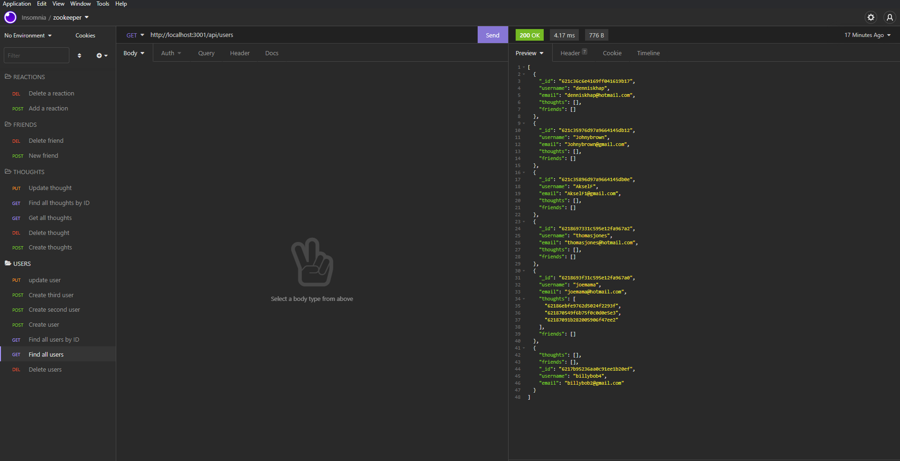

# Networking - API

This project uses Mongodb and allows you to GET, PUT, DELETE, and POST data into the database. This project also impliments express.js and the mongoose package. 


## Installation

Install my-project with npm mongoose, and express.js

```bash
  npm i mongoose
  npm i express
  npm start
```
    

## License

[MIT](https://choosealicense.com/licenses/mit/)


## Screenshots




## Feedback

If you have any feedback, please reach out to me on twitter @Dennnyboyy
